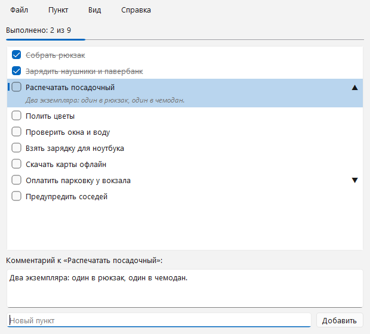
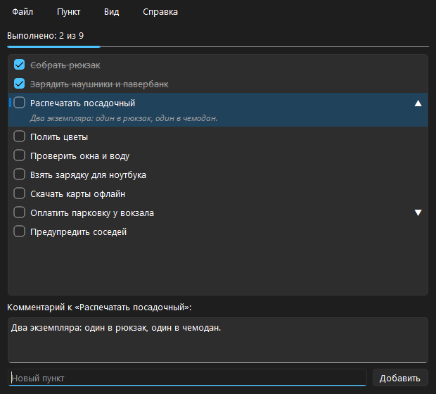

<div align="center">

# CheckProg

**A checklist for Windows: tick items off, keep a note on any of them, follow the system dark theme. Every list is a plain `.json` file of its own.**

[Download for Windows](https://github.com/ALEXalesha/CheckProg/releases/latest) &nbsp;·&nbsp; [Русская версия этого файла](README.ru.md)

[](https://github.com/ALEXalesha/CheckProg/actions/workflows/ci.yml)
[](https://github.com/ALEXalesha/CheckProg/releases/latest)
[](LICENSE)



</div>

> **The interface is in Russian**, and so is the user guide in [README.ru.md](README.ru.md). In the screenshot, "Выполнено: 2 из 9" means "done: 2 of 9", "Комментарий к…" is the note panel and "Добавить" is the add button.

## What it is

A checklist that behaves like Notepad: one list is one file, `Ctrl+S` saves it, the title shows `*` while there are unsaved changes, and the last list opens again on the next start. Shopping, the week's errands, what to pack - a separate file each.

| | |
| --- | --- |
| Items | add, rename in place (`F2`), delete, reorder by drag or `Ctrl+↑`/`Ctrl+↓`, tick with the mouse or `Space` |
| Notes | any item can carry a multi-line note; the row shows `▼` and expands it under the item in grey italics |
| Themes | follow Windows, or force light or dark; the choice is remembered and the whole UI follows, file dialogs included |
| Keyboard | every action has a shortcut, and the `Alt` ones work in the Russian layout as well |
| Storage | UTF-8 JSON you can edit by hand; saving is atomic, so a power cut cannot leave half a file |



## Download

| File | What it is |
| --- | --- |
| `CheckProg-<version>-Setup.exe` | Installer. Per-user install needs no admin rights |
| `CheckProg-<version>-Portable.zip` | Unpack anywhere, including a flash drive, and run `CheckProg.exe` |

Windows 10 or 11. The portable build keeps everything next to itself: while `portable.flag` is there, settings live in `settings.json` and lists are offered in a `lists` folder beside the program. An installed copy uses `%APPDATA%\CheckProg\settings.json` and `Documents\CheckProg`.

## File format

```json
{
  "version": 1,
  "items": [
    {"text": "Buy milk", "done": false, "note": "2.5%, two bottles"},
    {"text": "Call the bank", "done": true}
  ]
}
```

`text` is required, a missing `done` counts as not done, `note` is written only for items that have one, and items with empty text are skipped on load. Files written by 1.0 open unchanged.

## Qt since 2.0

The window was Tkinter until version 2.0. It was replaced with Qt (PySide6) for one measurable reason: with a long list of expanded notes, Tk re-wrapped every note on every resize step and the window visibly lagged while being dragged. The port is specified in `docs/superpowers/specs/2026-09-19-qt-port-design.md`, and the budget it had to meet became a test - see below.

## Running from source

Python 3.10 or newer (tested on 3.13). Everything is installed into the project's own `.venv`.

```bash
python -m venv .venv
.venv\Scripts\python -m pip install -r requirements-dev.txt
.venv\Scripts\python -m checkprog
```

## Tests

```bash
.venv\Scripts\python -m pytest -q
```

202 tests, about 8 seconds. They run against real windows, created and closed by the test itself.

The parts worth copying:

- **The resize budget is a test.** `test_perf.py` fills a window with 200 items that all have long expanded notes, then resizes it 100 times, every step to a new width so no wrapping is cached, and requires the average step to stay under 16 ms - one frame at 60 Hz. That is the number the Tk version could not hold, so the reason for the rewrite cannot quietly regress.
- **Keyboard tests send the physical key.** The menu shortcuts are `Alt+Ф/П/В/С` in the Russian layout and `Alt+F/P/V/S` in the English one, because both live on the same physical keys. The tests build the key event with the native virtual-key code rather than the letter, which is what makes the layout-independence real rather than assumed.
- **Random sequences.** `test_listmodel.py` and `test_window_more.py` apply long random sequences of add / toggle / move / delete / edit-note and check the model and the file agree afterwards.
- **The delegate is tested without a screen.** Row height, the arrow, wrapping and the strike-through of a done item are checked by measuring, not by looking.

`pytest-qt` creates the windows hidden, but on the real Windows platform plugin rather than Qt's `offscreen` one. Three tests need it: two read the palette that the system theme produces, and one paints a row and checks that ink actually landed in the text area. Under `offscreen` those three fail, which is why CI does not set `QT_QPA_PLATFORM`.

## Building the Windows binaries

```bash
winget install JRSoftware.InnoSetup
powershell -ExecutionPolicy Bypass -File packaging\build.ps1
```

The script creates `.venv` if needed, installs the dependencies, runs the tests, and writes `dist/CheckProg-<version>-Portable.zip` and `dist/CheckProg-<version>-Setup.exe`. Without Inno Setup it builds the portable archive only.

## Screenshots are generated

`tools/make_screenshots.py` writes a sample list, opens it in a real window and captures the widget with `QWidget.grab()`, once per theme. A screen grab by window rectangle would be wrong: a window that just opened can sit behind others, and then the shot catches someone else's content. The settings go to a temporary folder, so the author's own `settings.json` and "last file" are left alone.

## Stack

Python · PySide6 (Qt 6) · pytest · pytest-qt · PyInstaller · Inno Setup

## Licence

MIT, see [LICENSE](LICENSE).
